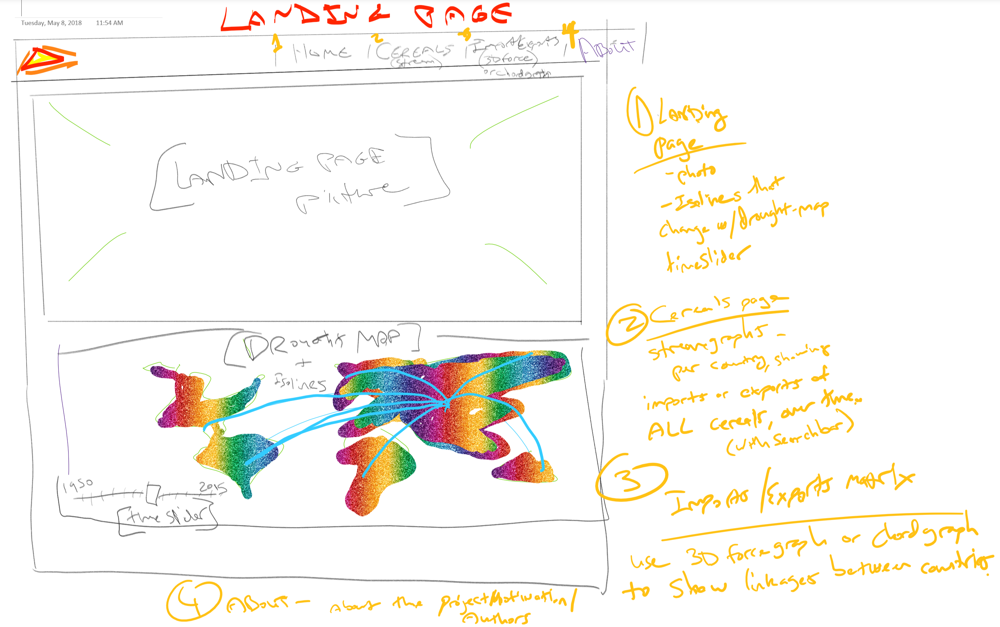

###### world-food-map-nexus-proposal ######
## Proposal
### for GEOG 4/572 project

# World Food-Drought Nexus #

*Group members:* 
**Bryce Bradshaw, Murthy Ganti, Max Boath**

*The motives:*
1. Look at world cereal production and trade (size-dependent isolines and Sankey diagrams)
2. Visually compare variations in food production/consumption to droughts using historical data (sweep/slider based visualization)
3. Visualize the difference between current and the maximum population that can be supported by the food produced in each country; Plot trends of these differences over time. 
4. Create JS code that will do use the data to project into future using simple models for population, food production and pressures (i.e., do something with the data to not just show it, but process it too, do some computation/optimization with the data).

*A description of the project:*\
Our map-based website will track 5 cereal food crop products’ movement around the world.  We will use data from FAO to feed a migration map (imports and exports by country, per crop), with an overarching coordinated-view that links active clicks to graphs of the data.  An underlying heatmap layer of drought-affected areas will tie food production/consumption to climatic events, and to see how the situation has evolved over time, we will apply a time-slider to our map.  Lastly, we hope to find a way to optimize the data on the fly, so that the website not only shows historical, recorded data, but may also be able to project trends into the future.

*Links to the data:*
+ [FAO World Cereal Food Production Data](http://www.fao.org/faostat/en/#data/QC/visualize "FAO Crop Map")
+ [World Drought Data](http://spei.csic.es/database.html)

*Interface Design References:*\
Coordinated view, similar to visuals of:
+ [FAOSTAT website](http://www.fao.org/faostat/en/#data/QC/visualize)
+ [World migration map](Migrationsmap.net)

*Potential URLs:*
+ fooddroughtnexus.com
+ cerealmigrations.com

# INTERFACE SKETCH #

